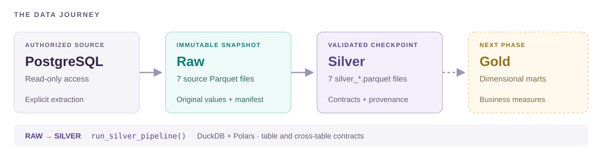

<p align="center">
  
</p>

<h1 align="center">Data &amp; Insights · Analytics Engineering Case</h1>

<p align="center"><strong>Understand manually. Automate deliberately. Preserve uncertainty.</strong></p>

<p align="center">
  <a href="#current-results">Results</a> ·
  <a href="#architecture-and-responsibilities">Architecture</a> ·
  <a href="#silver-decisions">Decisions</a> ·
  <a href="#run-locally">Run locally</a> ·
  <a href="#next-phase">Next phase</a>
</p>

---

## Project overview

This business case builds a reproducible analytical foundation for retail price data. Seven source tables covering prices, products, locations and nutritionals are assessed and transformed into a validated Silver layer, ready to support subsequent dimensional modelling and business analysis.

The central challenge is semantic as well as technical: repeated weekly observations, incomplete reference coverage and conflicting nutritional versions cannot be solved by enforcing uniqueness alone. The implementation distinguishes verified facts, adopted rules and unresolved exceptions, preserving the evidence needed for downstream decisions.

**Current delivery: checkpoint 2 — source discovery and productionized Silver.** Gold modelling and business measures remain the next phase.

| Discovery | Silver | Gold |
| :--- | :--- | :--- |
| **Complete** · 7 source assessments and 5 relationship checks | **Validated** · 7 published datasets and explicit contracts | **Next** · dimensional modelling and business measures |

| Weekly price observations in Silver | Exact duplicates removed | Offline tests passing | Notebook 02 execution |
| :---: | :---: | :---: | :---: |
| **19,075,099** | **142,972** | **18** | **60 / 60 code cells** |

These figures describe the reviewed local snapshot. Known data exceptions remain visible; passing contracts establish the stated structural guarantees.

## Deliverables

| Deliverable | Evidence / implementation |
| --- | --- |
| Source assessment | [01 · Source discovery](notebooks/01_source_discovery.ipynb): grain, quality, temporal coverage and relationship evidence |
| Silver decision record | [02 · Silver pipeline](notebooks/02_silver_pipeline.ipynb): treatments, contracts, published metrics and interpretation |
| Reproducible execution | [Official pipeline](src/daltix_case/pipelines/silver_pipeline.py): all seven tables, validation and controlled publication |
| Verification | [Offline tests](tests/), full-snapshot checks and a fresh execution of Notebook 02 |

**Execution model:** pipeline → validated Silver files → Notebook 02. The notebook's default `RUN_PIPELINE = False` inspects an existing publication; missing or stale artifacts fail validation. [Reproduction instructions](#run-locally) describe the sequence.

## Architecture and responsibilities



**Storage:** `data/raw/` → `data/clean/` → `data/marts/`. Each completed local layer carries its own manifest; Gold is not yet implemented.

| Component | Responsibility |
| --- | --- |
| [Notebook 01](notebooks/01_source_discovery.ipynb) | Manual discovery, exact checks, relationships and the proposals made at that stage |
| [Notebook 02](notebooks/02_silver_pipeline.ipynb) | Decisions, read-only evidence and interpretation; optionally calls the official pipeline |
| [`silver/*`](src/daltix_case/silver/) | Single implementation of each table's cleaning and enrichment |
| [`quality/*`](src/daltix_case/quality/) | Shared validation helpers and cross-table contracts |
| [`silver_pipeline.py`](src/daltix_case/pipelines/silver_pipeline.py) | Dependency ordering, publication, timing and manifest |
| [`source_io.py`](src/daltix_case/source_io.py) | Guarded extraction, connections and Raw-snapshot integrity |

The table functions accept input/output paths; the orchestrator owns publication. Transformation logic is centralized in `src`, and both notebooks retain their distinct analytical responsibilities.

## Current results

Published Parquet files use `silver_<dataset>.parquet`; Raw files keep their source names. The pipeline, relationship checks and notebook share this naming convention.

These counts describe the reviewed Silver snapshot. The machine-readable source for a completed run is `data/clean/manifest.json`.

| Silver file | Rows | Main outcome |
| --- | ---: | --- |
| `silver_products.parquet` | 32,826 | Unique source IDs; missing name 42, brand 1,279, description 8,013, categories 497 |
| `silver_locations.parquet` | 1,638 | Two rows share one business key; 40 missing postcodes, 18 missing coordinate pairs |
| `silver_prices.parquet` | 1,198,547 | 1,191,783 null promo prices; 6,764 promotions; zero unexpected populated promo values |
| `silver_nutritionals.parquet` | 9,467,978 | 54,155 products, 14 nutrient names; 100 source conflicts canonicalized; zero non-numeric values |
| `silver_weekly_products.parquet` | 114,517 | Zero enriched attributes; missing name 9, brand 9,589, description 14,562, categories 23,294 |
| `silver_weekly_locations.parquet` | 1,230 | Zero enriched postcodes/coordinates; 23 missing postcodes, six missing coordinate pairs |
| `silver_weekly_prices.parquet` | 19,075,099 | 142,972 exact duplicates removed; 751,824 ambiguous rows in 375,912 grains |

Weekly Silver prices contain **1,636,220 promotion rows** and **10,916 promo-above-price rows**. All table and cross-table contracts pass. Weekly product coverage is **96.06%**, with **751,710 unmatched price rows**; weekly location coverage is complete. **15,696** weekly products overlap with nutritionals.

### How the weekly observations were treated

| Step | Observations | Meaning |
| --- | ---: | --- |
| Raw snapshot | 19,218,071 | Original price observations, including repeated records |
| Exact duplicates removed | −142,972 | Only identical six-field observations were collapsed |
| Published Silver | **19,075,099** | Retained observations after exact deduplication |
| Ambiguous observations within Silver | **751,824** | A subset of Silver, spanning 375,912 weekly grains; alternatives remain available |

**Retained rows = 19,218,071 − 142,972.** Ambiguous observations are included in the retained total and still require an explicit Gold treatment.

## Silver decisions

| Table | Grain / key | Treatment and boundary |
| --- | --- | --- |
| Products | One row per source `daltix_id` | Trim text, normalize assessed missing tokens, preserve country/language and nullable attributes. Snapshot uniqueness does not imply a universal identifier. |
| Locations | Working `(shop, id)` | Preserve the known collision and mark both records unsafe for fallback. Drop the all-null `type` from this Silver projection; retain it in Raw. Keep nullable geography and explicit country. |
| Prices | `(daltix_id, shop, location, downloaded_on)` | Preserve all observations. Keep null `promo_price`; the adopted convention is no active promotion in this source. Present values below regular price indicate promotion. |
| Nutritionals | `(daltix_id, shop, country, download_date, nutrient_name)` after canonical selection | Keep the existing completeness-first policy, long representation and conflict lineage. Retain portion and units; do not invent conversions. |
| Weekly products | One row per source `daltix_id` | Primary values win. Fallback fills missing attributes only when retailer, country and language agree. Literal disagreements are flagged. |
| Weekly locations | `(shop, location)` | Use only unambiguous fallback keys without contradictory known geography. Fill coordinates only as a pair when both primary values are missing. |
| Weekly prices | Working `(daltix_id, shop, location, week)` | Remove only identical six-field observations. Preserve alternative price pairs and explicit ambiguity. Keep price extremes pending contextual evidence. |

Silver retains natural keys. `price_observation_id` is a deterministic fingerprint of an observation, not a replacement for its business grain or a dimensional surrogate key. Gold keys and measures are future work.

<details>
<summary><strong>Null handling and source-specific promotion semantics</strong></summary>

Text cleaning recognizes trimmed, case-insensitive `""`, `null`, `none`, `n/a` and `#n/a`. SQL null stays null. `NAN` and `NA` are preserved because a blanket rule can destroy legitimate values. The helper accepts explicit field-specific tokens when future evidence justifies them.

Missing descriptive fields, postcodes and coordinate pairs do not justify deleting an entity. No price, description or nutritional value is invented to achieve completeness. Invalid numeric text must fail rather than silently becoming a meaningful null; numeric NaN/infinity fail numeric validity checks.

The weekly and non-weekly promotional fields have different source conventions. Weekly `price_promo = price` means no observed discount under the adopted rule; lower values indicate a discount; higher values are retained and flagged. Non-weekly `promo_price = NULL` is preserved and interpreted according to that source's adopted convention. Frequency and value relationships support the interpretation but do not independently prove business semantics.

</details>

<details>
<summary><strong>Nutritional selection, portion basis and unresolved unit issues</strong></summary>

The existing selection order is preserved: numeric nutrient count, nutrient count, populated unit count, then serialized-payload hash and language, with source-row order as the final tie-break. Selected outputs carry the payload hash and completeness scores. Raw retains all competing versions.

Of the 100 conflicting grains, nine are decided by completeness and **91 require the deterministic tie-break**. The legacy `nutrition_resolution_rule` and `resolved_*` metric names remain for compatibility; they describe canonicalization, not proven truth. `nutrition_selection_reason` distinguishes hash ties explicitly.

The Raw payloads include **1,034,946 observations per 100 g** and **61,596 per 100 ml**. Silver carries the selected version's portion basis so its values remain interpretable. There are **70 nutrient rows across nine products with unexpected units**. They remain flagged for review; automatic unit conversion would invent an unsupported interpretation.

A download date is collection time, not automatically an effective-from date. Nutritionals from late 2020/early 2021 must not silently enrich earlier price history as if those attributes were known then.

</details>

<details>
<summary><strong>Enrichment safety and why zero filled attributes is a valid result</strong></summary>

Compatible product matches number **9,406**, yet fill zero missing attributes. The logic is retained because future compatible snapshots may contain useful fallback values. Primary values are never overwritten.

Literal product disagreements number 9,356 names, 103 brands, 4,221 descriptions and 5,513 categories; **7,651 name disagreements are case-only**. These are monitoring signals, not automatic evidence of different products.

Weekly locations have zero safe fallback matches. The known non-weekly collision is excluded; other candidates must not contradict existing postcode/coordinates. The coordinate tolerance is a technical equality tolerance, not geographic identity proof. Matching identifiers and context do not establish historical compatibility.

</details>

## Data quality and publication

| Mechanism | Purpose | Examples |
| --- | --- | --- |
| **Hard contracts** | Stop publication when a structural guarantee fails | Required schema and fields, exact keys where justified, safe joins, finite numeric values and row reconciliation |
| **DQ flags** | Identify exceptions retained in the output | Location-key collision, weekly price ambiguity, attribute disagreements and unusual nutrient units |
| **Monitoring metrics** | Quantify gaps for interpretation | Missing descriptions, partial product coverage and enrichment outcomes |

Unexpected columns require review before projection or deduplication. Date fields keep the assessed daily type, and timestamps are not silently truncated.

<details>
<summary><strong>Publication safeguards, manifest contents and recovery boundary</strong></summary>

The orchestrator:


1. Validates the Raw manifest and records a source-code fingerprint.
2. Builds all outputs in a private staging directory under `data/clean`.
3. Runs table and cross-table contracts before publication.
4. Confirms that Raw and source code did not change during the run.
5. Publishes the validated files, with the manifest last; ordinary publication failures roll back.

The Silver manifest records input hashes/provenance, runtime versions, output schemas/hashes, counts, metrics and timing. The notebook checks the actual artifacts against this manifest before presenting results.

This is a single-user checkpoint workflow. Individual file replacements are atomic; the seven-file set is not a database transaction. A lock prevents cooperating readers/writers from accepting partial publication. After an abrupt process or machine failure, inspect the retained lock/staging/backup before recovery; do not blindly remove them and assume a valid checkpoint.

</details>

## Why discovery was deliberately extensive

**Understand manually, then automate deliberately.** Exploration established grain, missingness, temporal coverage, duplicates and relationship safety before those observations became rules. Large row counts and approximate profiles alone were insufficient.

The discovery notebook retains the questions and evidence; the Silver notebook explains the decisions now implemented. Some early proposals were refined: nutritional conflicts now have an explicit deterministic selection policy, and the non-weekly promotion convention is documented. Earlier Raw counts are not silently replaced by post-cleaning counts.

## Technology and storage choices

| Tool | Workload and reason |
| --- | --- |
| Parquet | Typed columnar storage, compression and selective reads. Raw and Silver are separate artifacts. |
| DuckDB | Relational aggregation, exact grain checks, windows, JSON normalization and large Parquet-to-Parquet transformations. |
| Polars | Cleaning and enrichment of smaller references, typed expressions and validation. |
| Python | Small reusable table functions, orchestration, errors, tests and provenance. |

The 19.2M weekly price rows and 9.5M long nutrient rows are not collected into Python dataframes. The nutritional source is a smaller, roughly 1.1M-row JSON dataset loaded for source preparation, then processed by DuckDB. Expensive nutritional ranking is materialized once per run; weekly contracts inspect the written candidate instead of rebuilding its transformation.

There is no claim that one engine is universally fastest. A verified local full run took approximately **105 seconds**, including integrity, provenance and validation checks. The earlier reported run was about 161 seconds under a different validation workload; this is not a controlled performance benchmark.

## Run locally

The project uses Python **3.14** and `uv.lock`. Runtime dependencies are limited to DuckDB, Polars, PyArrow, Psycopg and python-dotenv; the development group supplies the notebook kernel, pytest and Ruff. Unused ML/visualization packages are not required for this phase.

1. Restore the locked environment:

   ```sh
   uv sync --locked
   ```

2. Build and validate all seven Silver files:

   ```sh
   uv run python -m daltix_case.pipelines.silver_pipeline
   ```

3. Open `notebooks/02_silver_pipeline.ipynb`, select the project kernel, leave `RUN_PIPELINE = False`, then restart and run all cells. This reads the already-published `silver_*.parquet` files and checks the manifest.

The optional `RUN_PIPELINE = True` setting delegates a rebuild to the same official function. The normal review workflow above keeps execution in the pipeline and inspection in the notebook.

Paths default to the local checkout. An isolated output can be selected explicitly:

```sh
uv run python -m daltix_case.pipelines.silver_pipeline --raw-dir data/raw --silver-dir data/clean/review
```

A clone includes code, documentation and notebook evidence, but no private source data. Local reproduction requires all seven Raw Parquet files and their manifest. Credentials are unnecessary for normal Raw-to-Silver runs.

<details>
<summary><strong>First extraction, source access and the limits of the Raw manifest</strong></summary>

For first source access, copy `.env.example` to `.env` and populate authorized credentials privately. In Notebook 01, `RUN_SOURCE_DISCOVERY` and `RUN_EXTRACTION` default to `False`. Extraction is explicit, read-only, refuses an existing destination and validates COPY counts against Parquet metadata. A later refresh requires a separate snapshot; Raw is not overwritten.

The historical Raw manifest is an integrity baseline. Original extraction time and source-side reconciliation remain unknown. Future helper-driven exports record provenance and COPY-to-Parquet reconciliation, but do not promise a transactionally consistent seven-table snapshot. PostgreSQL storage including indexes is not directly comparable to Parquet size as a compression benchmark.

</details>

## Validation

```sh
uv run ruff check src notebooks tests
uv run ruff format --check src notebooks tests
uv run pytest -q
```

The compact test suite covers source-I/O safeguards, assessed null tokens, key/schema/type checks, safe enrichment, exact versus conflicting duplicates, nutritional selection/portion/units, a tiny seven-table pipeline, manifest validation and publication failure/rollback. It runs without credentials or private datasets.

Full-snapshot verification additionally compares the previous and revised Silver values, allowing only the documented name/brand corrections and added provenance fields. Notebook 02 is executed in a fresh process against the completed checkpoint. Notebook 01 retains its analytical code and outputs; editorial changes clarify the historical/current boundary.

<details>
<summary><strong>Verified corrections and the filename migration</strong></summary>

A global missing-token rule incorrectly treated the genuine brand `NAN` as missing and failed to recognize `#N/A`. The corrected rule restores two brands in `products` and 17 in `weekly_products`; one placeholder name becomes null in each. These are intentional value changes, not a claim of byte-identical outputs.

| Missingness metric | Previous | Corrected |
| --- | ---: | ---: |
| Products: name | 41 | 42 |
| Products: brand | 1,281 | 1,279 |
| Weekly products: name | 8 | 9 |
| Weekly products: brand | 9,606 | 9,589 |

Nutritional outputs additionally retain portion basis, selected payload hash, completeness scores, a precise selection reason and an unexpected-unit flag. Weekly locations additionally expose the context-mismatch flag. Existing selected nutritional values, price observations, grains and conflict policies are preserved.

Every published Parquet uses the `silver_` prefix. Pipeline writers, fallback reads, relationship checks, the notebook and the manifest use the same names. The initial naming migration preserved **identical SHA-256 content hashes**; a subsequent full rebuild verifies that the pipeline produces these names directly, with unchanged metrics and schemas.

</details>

## Discovery evidence

The complete analytical cells and saved Raw outputs remain in [Notebook 01](notebooks/01_source_discovery.ipynb). Exact checks supersede `SUMMARIZE.approx_unique` for keys and calendar coverage. Dataset-wide dates do not establish complete histories per product/location.

<details>
<summary>Raw findings and relationship coverage</summary>

- **Weekly prices:** 19,218,071 rows, 102,069 products, 375,742 product/shop/location combinations and 18,699,187 weekly keys. Calendar: 2019-01-07 to 2020-12-28, 104/104 weeks. Earlier approximate counts of 108,487 IDs and 93 weeks are not constraints.
- Repeated keys occur in three weeks: 2019-05-27 (126,619), 2019-12-30 (188,398) and 2020-12-28 (203,867). All repeated groups have two records: 1,037,768 affected rows. Across those groups, 142,972 price pairs are identical and 375,912 differ.
- Raw weekly promotion relationships: 1,638,468 lower, 17,568,677 equal and 10,926 higher. Post-deduplication counts differ because the population differs.
- Weekly regular prices range 0.009–1,538.90: 506 rows below 0.10, 38,416 above 100 and 3,378 above 500. Recurrence does not prove validity; product/pack/unit context is still needed. Weekly rows do not carry explicit currency/unit fields, so the non-weekly sample's `eur`/`su` cannot silently supply them.
- **Weekly products:** 114,517 unique IDs. All current rows have country `be` and language `nl`; this does not mean two countries. Semantic brand missingness is 8.37%, versus 5.77% SQL-null-only profiling.
- **Weekly locations:** 1,230 rows, 1,140 location IDs and 1,230 shop/location pairs. `shop_type` is absent in 436 records, including all 392 `idla` and 42 `plc` rows. Locality/state each miss ten values; six coordinate pairs are absent.
- Seven coordinate pairs are shared, five within a retailer. Repeated names, shared coordinates and four postcodes outside a four-digit pattern do not independently justify merging or rejecting locations. Country context matters.
- **Prices:** 1,198,547 rows, 116 products, 136 locations and 3,631 product/shop/location combinations. All 367 dates from 2020-02-25 to 2021-02-25 occur. Unit/currency are `su`/`eur`; regular prices range 0.297–9.779. Large row volume does not mean broad product coverage.
- **Products:** 32,826 unique IDs; several retailers span countries and some languages. Country cannot be inferred from shop. Missingness depends on whether the check counts only SQL nulls or semantic placeholders.
- **Locations:** 1,638 rows, 1,256 IDs and 1,637 shop/ID keys. `lld + f334d` has postcode 1470 at 50.601871, 4.4583208 and postcode 7100 at 50.452781, 4.1538596; adding country does not resolve it. Bounds are technically valid, not proof of the correct address.
- **Nutritionals:** 1,096,542 Raw observations, 54,155 products and 1,096,442 product/shop/country/date keys. All 90 dates from 2020-11-27 to 2021-02-24 occur. The 185 distinct nutrient-key sets are not 185 fully validated typed schemas. Later validation confirms real value conflicts in the 100 repeated grains.

| Raw relationship | Evidence and limitation |
| --- | --- |
| Weekly prices → weekly products | 88,897/102,069 products matched; 18,460,902/19,218,071 rows (96.06%). No multiplication; 25,620 weekly references unused. |
| Weekly prices → weekly locations | 100% matching and no multiplication using shop/location; only 16 of 1,230 reference keys used. |
| Prices → products | 20/116 products and 15.40% of rows matched; safe cardinality coexists with low coverage. |
| Prices → locations | 100% matching and no multiplication using shop/location; location alone adds 2,253,016 rows. Only 136/1,637 reference keys used. |
| Weekly products → nutritionals | 15,696 products matched (13.71% of weekly, 28.98% of nutritional products), producing 261,224 Raw nutritional observations. This is temporal one-to-many history, not a safe direct fact enrichment. |

Matched nutritional products have mean 16.64 observations, median 19 and maximum 32; 14,145 have multiple observations. Context agreement does not choose a historical version. Raw relationship counts include records later deduplicated in Silver.

</details>

## Project structure

```text
README.md                       Case study, results and reproduction
docs/assets/                    Company logo and architecture diagram
notebooks/
  01_source_discovery.ipynb       Raw evidence and relationship exploration
  02_silver_pipeline.ipynb        Silver decisions, metrics and interpretation
src/daltix_case/
  source_io.py                   Guarded extraction and Raw manifest
  quality/
    checks.py                    Small shared validation helpers
    cross_table.py               Relationship contracts
  silver/
    products.py, locations.py, prices.py, nutritionals.py
    weekly_products.py, weekly_locations.py, weekly_prices.py
  pipelines/silver_pipeline.py   Official end-to-end entry point
tests/                          Offline source, rule and pipeline tests
data/raw/                       Private immutable snapshot; ignored
data/clean/                     Generated Silver checkpoint; ignored
data/marts/                     Reserved for Gold; ignored
sql/                            Reserved; no independent SQL pipeline
```

`.env`, environments, source/generated datasets, notebook checkpoints and caches are ignored. Saved notebook outputs provide review evidence; they are checked for credentials before publication. Transformation code has one implementation in `src`.

## Next phase

The next phase will translate business questions into explicit fact and dimension grains. Weekly prices are the leading core fact candidate; additional non-weekly facts or nutritional dimensions will be introduced only where the analytical requirements justify them.

Gold design must address ambiguous weekly observations, unmatched product references, historical product/nutritional attributes, portion and unit compatibility, and product/pack comparability. These are explicit modelling decisions still to be made.

There are no established sales quantities, margins or shopper-response measures. Price observations alone cannot establish sales uplift, demand elasticity or promotion effectiveness. Surrogate keys belong to the future dimensional model, not to a workaround that hides Silver business-key collisions.


## Checkpoint history

| Checkpoint | Scope |
| --- | --- |
| **01** · `f117982` | Initial source discovery checkpoint |
| **02** · current | Completed discovery and relationships; reusable Silver pipeline; contracts and tests; validated Silver notebook; documented decisions and architecture |

Source data, credentials and generated Parquet files are excluded from version control.
