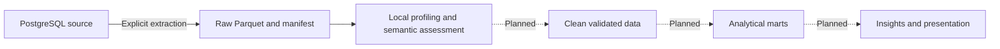

# Daltix Data & Insights Case

> Understand the source, test the assumptions, then build a defensible retail analysis.

**IN PROGRESS · CHECKPOINT 1**

Source discovery, initial profiling and weekly-price grain/coverage assessment.

[Status](#checkpoint-status) · [Architecture](#architecture) · [Findings](#initial-profiling-conclusions) · [Weekly assessment](#evidence-from-the-saved-weekly-price-assessment) · [Run tomorrow](#run-tomorrow) · [Validation](#validation-and-limitations)

## Checkpoint status

This is the first development checkpoint, not the final business-case submission. The analytical questions, cleaning rules and final model remain under investigation.

| Completed | Next |
| --- | --- |
| Local environment and seven-table source discovery | Promotion semantics and price validity |
| Raw extraction and automated profiling | Product/location keys and join coverage |
| Weekly grain and aggregate temporal assessment | Resolve repeated observations with evidence |
| Documented findings and reproducible local execution | Clean data, analytical model and business insights |
| Protected extraction, local manifest and focused tests | Final presentation and optional BI |

**Tomorrow's starting point:** section 7 of [the discovery notebook](notebooks/01_source_discovery.ipynb), then develop **6.3 Promotion Logic**. Do not interpret a filled promotional-price field as proof of a promotion.

## Architecture

An ELT approach was selected: extract PostgreSQL source tables, load untransformed local Parquet and perform assessment and later transformations locally. It reduces repeated work on the supplied source and preserves a raw baseline for revisiting decisions.



| Component | Responsibility |
| --- | --- |
| Python 3.14, uv, `.venv`, `uv.lock` | Isolated dependencies and reproducible resolution |
| Jupyter and Markdown | Questions, SQL, results and interpretations |
| Psycopg | Optional lightweight metadata discovery with read-only transactions |
| DuckDB | Optional source export and local analytical SQL |
| Polars | Display and inspection of analytical results |
| Parquet with ZSTD | Typed, compressed raw files |
| PyArrow and SHA-256 | Local file metadata and integrity manifest |
| Ruff and pytest | Python hygiene and focused source/snapshot checks |

The environment includes additional ML and visualization libraries, but their presence does not imply that models or dashboards have been built. `raw`, `clean` and `marts` correspond conceptually to Bronze, Silver and Gold; only raw ingestion and assessment are implemented so far.

## Repository layout

```text
notebooks/01_source_discovery.ipynb  Exploration, analytical SQL and saved results
src/daltix_case/source_io.py        Source connections, protected export and manifest checks
src/daltix_case/__init__.py         Original package entry-point scaffold
tests/test_source_io.py             Offline tests of snapshot and connection behavior
.env.example                       Empty credential template
.gitignore                         Excludes credentials, raw data and generated files
.vscode/settings.json              Portable formatting settings
pyproject.toml / uv.lock            Project dependencies and locked resolution
data/raw/                          Local Parquet and manifest; excluded from Git
data/clean/ / data/marts/            Reserved for later stages; excluded from Git
```

The source-I/O helper handles execution and file protection. The notebook retains the analytical SQL: no deduplication, price-selection rule, join or promotion metric has been added by the checkpoint cleanup.

## Source inventory

| Table | Role under assessment |
| --- | --- |
| `weekly_prices` | Weekly product/location price observations |
| `weekly_prices_products` | Product attributes for the weekly dataset |
| `weekly_prices_locations` | Location attributes for the weekly dataset |
| `prices` | Non-weekly price observations |
| `products` | Non-weekly product attributes |
| `locations` | Non-weekly location attributes |
| `nutritionals` | Nutritional records and serialized nutritional values |

PostgreSQL catalog row counts are estimates. They must not be treated as exact counts or substituted for counts from the extracted data. DuckDB `SUMMARIZE` provides initial types, null percentages, ranges and distribution estimates; it does not validate business semantics or relational integrity.

## Initial profiling conclusions

All seven datasets were extracted and profiled. Row counts below were also checked directly against the local Parquet files during the documentation review. Null percentages come from the saved notebook profiles and are rounded to two decimal places.

| Dataset | Local rows | Findings and implications |
| --- | ---: | --- |
| `weekly_prices` | 19,218,071 | Two-year weekly history; primary analytical candidate. Six columns show 0.00% SQL nulls in the saved profile. Grain exceptions require investigation. |
| `weekly_prices_products` | 114,517 | `brand` 5.77% null; `categories` 20.34% null. Empty text also appears, so SQL nulls alone do not measure completeness. |
| `weekly_prices_locations` | 1,230 | `shop_type` 35.45% null; coordinates 0.49% null; postcode 1.87% null. Location meanings and joins remain unvalidated. |
| `prices` | 1,198,547 | Historical sample, 2020-02-25 to 2021-02-25. `promo_price` is null in 99.44% of observations; this is not a percentage of products or a confirmed no-promotion rate. `unit_std` and `currency` are reported as `su` and `eur`. |
| `products` | 32,826 | Nulls: name 0.12%, brand 2.25%, description 10.34%, categories 1.51%. Empty strings and `#N/A` require semantic assessment. |
| `locations` | 1,638 | `type` is entirely null. IDs are not globally unique; see the exact checks below. Missing coordinates for online records are a hypothesis to investigate, not grounds for automatic deletion. |
| `nutritionals` | 1,096,542 | Dated records from 2020-11-27 to 2021-02-24. Structured nutritional text requires parsing and content validation; 0.00% SQL nulls does not establish complete nutrient information. |

### Exact counts versus approximate profiles

`SUMMARIZE.approx_unique` is exploratory. The early profile estimated 93 weeks and 108,487 product IDs in `weekly_prices`; the saved exact queries returned **104 weeks and 102,069 IDs**. The exact results supersede those approximations. Neither similar distinct counts nor the same number of retailers proves that the actual sets overlap or that a join is safe.

The original profiling discussion reported retailer cardinalities of 4 for each weekly table, 5 for `prices`, 7 for `products`, 10 for `locations` and 6 for `nutritionals`. These came from the approximate profiling output; shared retailer sets and exact join coverage remain to be checked.

### Earlier location investigation recovered from the planning discussion

The discussion recorded 1,638 rows, 1,256 distinct `id` values, 1,637 distinct `(shop, id)` combinations and 1,638 distinct full rows. These four counts were rechecked against the local `locations.parquet` and agree.

Therefore, there are 382 occurrences beyond one row per `id`, but **no exact duplicate rows**. The composite `(shop, id)` still has one repeated combination. The earlier discussion identified different geographic attributes for that pair. Its business meaning remains unresolved; generating a surrogate key would distinguish records technically without resolving the semantic ambiguity.

### Why weekly is the main candidate

The planning discussion records the assignment's description of `weekly_prices` as a two-year, non-sampled dataset and its warning that sampling can impair joins between other tables. This motivates a focused weekly assessment; it does not prove complete coverage for every retailer, product or location.

The non-weekly tables remain available for separate analysis, comparison and spot checks. Their inclusion in the final model depends on demonstrated coverage and business value. They are not discarded, and they do not have to fit the same fact table.

### Nutritional enrichment and business limits

The preferred hypothesis discussed was to enrich product attributes with nutritionals where useful, rather than create a nutritional dimension solely because a separate source table exists. Repeated records and dates must be resolved before joining. A collection date is not necessarily an effective-from date; attaching the latest 2021 record to a 2019 price could introduce temporal leakage.

Possible future questions concern price position, price changes, assortment and promotional behavior. Cross-retailer comparisons need comparable products and units: `daltix_id` is a source product identifier in retailer/country context, not a proven universal product ID. Raw retailer mean prices can reflect different product mixes.

No sales, quantities sold, margins or shopper-response data have been established in the seven datasets. The project should not claim sales uplift, demand elasticity or promotion effectiveness from price observations alone. No business insight or predictive model has been finalized.

## Evidence from the saved weekly-price assessment

The saved grain query reports 19,218,071 rows, 102,069 distinct product IDs, 375,742 product/retailer/location combinations, and 18,699,187 distinct candidate keys.

The candidate grain is `daltix_id + shop + location + week`. It is a working hypothesis, not a validated unique key. Repeated keys occur in three weeks:

| Week | Repeated key combinations | One distinct price pair | Multiple distinct price pairs |
| --- | ---: | ---: | ---: |
| 2019-05-27 | 126,619 | 39,196 | 87,423 |
| 2019-12-30 | 188,398 | 47,751 | 140,647 |
| 2020-12-28 | 203,867 | 56,025 | 147,842 |

The three weeks contain **518,884 repeated key combinations**: **142,972** with identical price pairs and **375,912** with different price pairs. The difference between total rows and distinct candidate keys is also 518,884. Together, the saved counts imply that each repeated group contains exactly two rows: 1,037,768 affected rows, approximately 5.40% of the dataset. The excess above one row per key is approximately 2.70%.

These counts represent key combinations, not excess rows in general; the two happen to match here because every repeated group has two rows. Equal-price duplicates and conflicting-price observations require separate treatment. No arbitrary first/last, averaging, or deduplication rule has been applied.

The saved temporal query reports a first week of 2019-01-07, a last week of 2020-12-28, 104 distinct observed weeks and 104 expected weekly periods. During this documentation review, a separate read-only local query confirmed those values, zero null weeks and zero dates outside Monday. Together, these establish no missing weekly dates across the overall range. Completeness at product/location level remains untested. This additional check has not been inserted into the notebook.

Saved profiling output reports no nulls in the six `weekly_prices` columns and price ranges of approximately 0.009 to 1,538.9 for both price fields. These are profiling observations, not proof that every value is valid. Promotion meaning, units, outliers and appropriate thresholds remain unresolved.

## Provisional model and data-quality strategy

```text
                    dim_product
                         |
dim_date ------ fact_weekly_prices ------ dim_location
                         |
                      dim_shop
```

This is a candidate design, not an implemented schema. A separate non-weekly fact could be considered later. Shared dimensions would require semantic compatibility; a galaxy/fact-constellation model is an option, not a requirement.

**Grain** describes what one observation represents. **Key uniqueness** tests whether columns distinguish records. Passing a uniqueness check alone does not establish business meaning, key stability or minimality. In the saved weekly counts, `daltix_id` and `(daltix_id, shop)` both have 102,069 values, so `shop` adds no distinct combinations in this snapshot; that does not establish universal ID behavior across all sources.

A weekly price fact could reference weekly product and location dimensions, but dimension uniqueness and join cardinality have not yet been established. Do not assume weekly and non-weekly identifiers are interchangeable.

Before publishing a clean fact table:

1. Confirm candidate keys and investigate the three affected weeks.
2. Separate identical duplicates from conflicting prices and document evidence for each resolution rule.
3. Preserve the aggregate calendar check and validate coverage per product/location series.
4. Establish the semantics of `price` and `price_promo`, including equality, nulls and discounts.
5. Check finite, positive prices and investigate outliers in product/unit context.
6. Validate dimension keys, unmatched references and join multiplication.
7. Assess non-weekly and nutritional data independently before linking datasets.
8. Define reproducible validation checks and retain an audit trail of rejected or transformed records.

### Proposed validation framework

The academic BI checks provide a starting point: business-key integrity, duplicate detection, fact-grain integrity and referential integrity. They must be adapted to the discovered model. In particular, the supplied classroom rule grouping only non-key dimension attributes is not equivalent to full-row duplicate detection: different entities may legitimately share descriptive attributes.

Additional checks can cover semantic missingness, types, value ranges, temporal completeness, join cardinality and raw-to-clean reconciliation. A future `dq_results` log could hold the table, rule, metric, status, details and execution time. This framework has been discussed but not implemented; thresholds and failure severity remain to be defined. A historical case dataset should be assessed against its expected period, not marked stale merely because it is old today.

### Decisions and learning so far

| Question | Evidence or constraint | Decision |
| --- | --- | --- |
| Where should heavy queries run? | Large weekly source and the assignment's local-processing guidance | Extract all seven tables and assess locally |
| Should repeated location IDs be deleted? | No full-row duplicates; one `(shop, id)` collision | Preserve the records and investigate their meaning |
| Is the weekly grain a valid unique key? | Repeats concentrated in three weeks | Retain it as a working hypothesis; do not enforce it yet |
| Are there 93 weeks? | Approximate profile versus exact count of 104 | Use exact checks for coverage and key decisions |
| Should all tables form one star schema? | Sampling, different scopes and untested joins | Keep the model provisional |
| Should advanced ML or BI be added now? | No finalized business question or clean model | Keep these optional and prioritize correctness |

## Run tomorrow

1. Open this repository in VS Code and select its `.venv` Python kernel.
2. Open `notebooks/01_source_discovery.ipynb`.
3. Keep both `RUN_SOURCE_DISCOVERY = False` and `RUN_EXTRACTION = False`.
4. Restart the kernel and run the notebook. With the existing raw files, this is a local-only run: no database credentials, source queries or PostgreSQL extension installation are needed.
5. Continue with promotion logic. Add new analytical cells before the final cleanup, or rerun the local DuckDB initialization after the connection has been closed.

The manifest check precedes profiling. Missing or changed raw files stop execution with an explicit error. Existing analytical outputs are historical evidence; rerunning refreshes them locally.

### Reproduce the environment

```sh
uv sync --locked --group dev
```

The package is installed from `src`, so its helper is available in the project kernel. A clone includes code, documentation and saved analytical outputs, but not the private data. Local execution requires the seven raw Parquet files; otherwise authorized source access and an explicit first extraction are required.

### Optional source discovery

Copy `.env.example` to `.env` and fill the six source variables through the authorized credential channel. Set `RUN_SOURCE_DISCOVERY = True` only when refreshing source metadata. Psycopg uses read-only transactions, connection/query timeouts and context managers that close connections on success or failure. Restore `False` for normal analysis.

### Optional first extraction

Set `RUN_EXTRACTION = True` only for an unused raw destination. The helper checks all seven file paths and `manifest.json` before connecting and refuses existing destinations. It uses a short-lived DuckDB PostgreSQL attachment in read-only mode, with a safely built connection string and quoted schema/table names.

Exports first go to temporary staging on the same filesystem. The helper compares each COPY result's row count with local Parquet metadata before publishing. Destination creation refuses overwrite, and the manifest is published last. An export failure does not leave a successful manifest. Restore `False` after an intentional extraction.

This is a lightweight single-user workflow, not a transactionally atomic multi-table ingestion service. Do not run simultaneous extractions into the same directory. Abrupt machine/process failure during publication may leave an incomplete destination to investigate; normal execution does not silently replace it.

### What the manifest proves

`data/raw/manifest.json` records table/file names, row counts, byte sizes, schemas, SHA-256 fingerprints and provenance. It is local and ignored by Git.

For the existing historical files, the manifest is a baseline recorded during checkpoint preparation: original extraction time and original source row reconciliation remain explicitly unknown. They cannot be reconstructed reliably from filesystem modification times.

Future helper-driven exports record extraction start/end, source schema and COPY-to-Parquet row reconciliation without an extra remote COUNT scan. Neither mode establishes transactionally consistent source contents across seven tables or certifies business correctness. Hashes detect changes relative to the recorded local baseline.

## Validation and limitations

```sh
uv run ruff check src notebooks tests
uv run ruff format --check src notebooks tests
uv run pytest -q
```

Checkpoint verification: all eight offline tests passed, Ruff lint and formatting checks passed, and every code cell ran sequentially in a fresh Python process against the local snapshot. Credential loading and source-access helpers were explicitly blocked during that run. Exact grain, repeated-group and temporal results matched the saved conclusions. Notebook outputs were not overwritten by this verification.

The focused offline tests cover disabled extraction, refusal to overwrite existing files, incomplete snapshots, manifest change detection, credentials containing special characters, read-only connection options, connection closure on errors, and successful/failed COPY row reconciliation with a database stub. They do not contact the source database.

### Review items resolved in this checkpoint

| Original issue | Current implementation |
| --- | --- |
| Undefined `weekly_prices_path` | Defined explicitly in notebook configuration. |
| Extraction coupled to every analysis run | Two switches default to local-only mode; separate helper handles opt-in export. |
| Existing raw files could be replaced | Preflight check, staged export and exclusive destination creation. |
| Data/checkpoints not ignored | `.gitignore` excludes raw/clean/marts, Parquet, checkpoints, credentials and caches. |
| Duplicate DuckDB setup | One local analytical connection; source attachments have their own bounded lifetime. |
| Incomplete or inconsistent Markdown | Contents, seven-table conclusions, grain/coverage narrative and next-session instructions aligned. |
| Psycopg not explicitly read-only | Read-only session default plus context-managed connections/cursors. |
| Fragile credentials and fixed schema | Psycopg connection-string builder and escaped SQL values/identifiers; hard-coded preview removed. |
| File size mistaken for completeness | Manifest validates local file identity and schema; future exports reconcile COPY row counts. Historical source completeness remains unknown. |

Analytical queries and saved analytical outputs were preserved. Stale source/setup/export outputs were cleared after their execution behavior changed. The cleanup does not claim a new remote extraction occurred.

### Still open

- Explain the three exceptional weeks before choosing any deduplication or conflicting-price rule.
- Establish promotion semantics, validity, units and contextual outliers.
- Check per-product/location temporal coverage, dimension keys and join behavior.
- Bring supplementary calendar/location checks into maintained analytical validation where useful.
- Define the business question and population behind each metric; decide whether nutritional or non-weekly data adds value.
- Implement clean data, marts and accepted data-quality expectations after those decisions.

## Interpretation notes

Approximate cardinalities do not establish keys, similar counts do not prove matching sets, and SQL null percentages do not capture semantic missingness. Unique descriptive attributes are not a universal requirement for dimensions.

PostgreSQL's reported 4,605 MB for weekly prices included 2,168 MB of indexes; comparing that total with roughly 619 MiB of Parquet is not a pure compression ratio.

No benchmark establishes one engine as universally fastest. Keep the current SQL approach, measure slow queries and only then consider caching reused results or benchmarking native DuckDB tables for repeated joins. Ruff validates Python hygiene, not analytical meaning.

Technical references: [DuckDB SUMMARIZE](https://duckdb.org/docs/current/guides/meta/summarize), [DuckDB workload tuning](https://duckdb.org/docs/current/guides/performance/how_to_tune_workloads), [DuckDB file-format trade-offs](https://www.duckdb.org/docs/current/guides/performance/file_formats), [Psycopg connection-string builder](https://www.psycopg.org/psycopg3/docs/api/conninfo.html).
